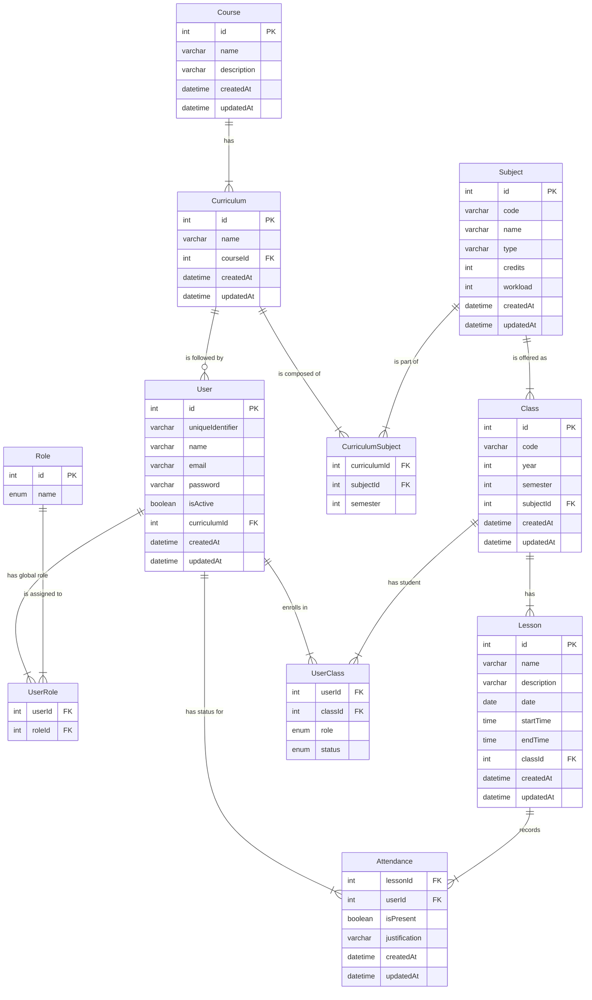
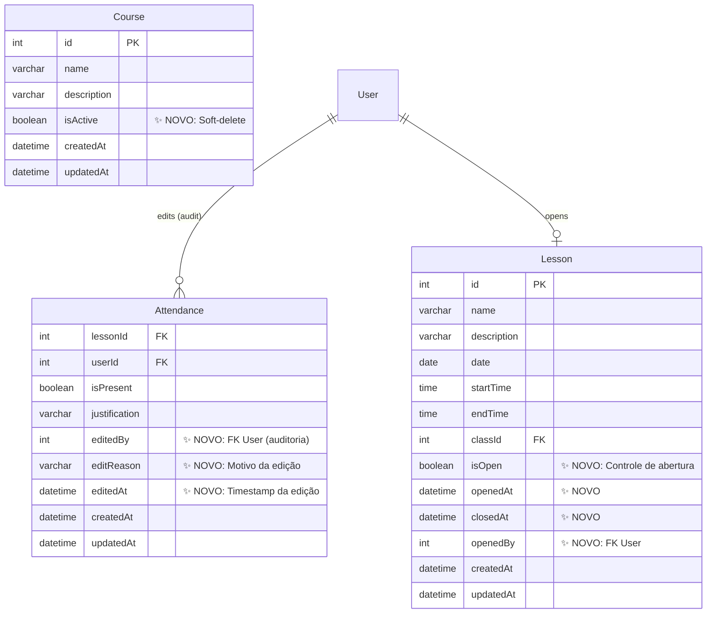

# 📊 Diagrama ER vs Schema Prisma Atual
## Comparação e Validação

**Data:** 02/10/2025  
**Objetivo:** Validar se o schema implementado corresponde ao diagrama planejado

---

## 🗺️ Diagrama ER Planejado (Mermaid)



---

## ✅ Validação: Diagrama vs Schema Atual

### 1. User ✅ CORRETO
**Diagrama:**
```
int id PK
varchar uniqueIdentifier
varchar name
varchar email
varchar password
boolean isActive
int curriculumId FK
datetime createdAt
datetime updatedAt
```

**Schema Prisma Atual:**
```prisma
model User {
  id                   Int            @id @default(autoincrement())
  uniqueIdentifier     String         @unique
  name                 String
  email                String         @unique
  password             String
  isActive             Boolean        @default(true)
  curriculumId         Int?
  createdAt            DateTime       @default(now())
  updatedAt            DateTime       @updatedAt
  
  // ✨ CAMPOS EXTRAS (implementação MVP):
  attendances          Attendance[]   @relation("AttendanceUser")
  editedAttendances    Attendance[]   @relation("AttendanceEditor")
  // ...
}
```

**Status:** ✅ **100% COMPATÍVEL**
- Todos os campos do diagrama presentes
- Campos extras adicionados para auditoria (não quebram o diagrama)
- `curriculumId` é opcional (`?`) como esperado

---

### 2. Role ✅ CORRETO
**Diagrama:**
```
int id PK
enum name
```

**Schema Prisma:**
```prisma
enum RoleName {
  USER
  ADMIN
  PROFESSOR
}

model Role {
  id    Int      @id @default(autoincrement())
  name  RoleName @unique
  users UserRole[]
}
```

**Status:** ✅ **PERFEITO**
- Enum definido
- Relacionamento com UserRole

---

### 3. UserRole ✅ CORRETO
**Diagrama:**
```
int userId FK
int roleId FK
```

**Schema Prisma:**
```prisma
model UserRole {
  userId Int
  roleId Int
  user   User @relation(fields: [userId], references: [id])
  role   Role @relation(fields: [roleId], references: [id])

  @@id([userId, roleId])
}
```

**Status:** ✅ **PERFEITO**
- Chave composta (userId, roleId)
- Relacionamentos corretos

---

### 4. Course ⚠️ MELHORADO
**Diagrama:**
```
int id PK
varchar name
varchar description
datetime createdAt
datetime updatedAt
```

**Schema Prisma Atual:**
```prisma
model Course {
  id          Int          @id @default(autoincrement())
  name        String       @unique
  description String?
  createdAt   DateTime     @default(now())
  updatedAt   DateTime     @updatedAt
  
  // ✨ CAMPO EXTRA (implementação MVP):
  isActive    Boolean      @default(true)  // Soft-delete
}
```

**Status:** ✅ **MELHORADO**
- Todos os campos do diagrama presentes
- `isActive` adicionado para soft-delete (melhoria)
- `description` é opcional como esperado

---

### 5. Curriculum ✅ CORRETO
**Diagrama:**
```
int id PK
varchar name
int courseId FK
datetime createdAt
datetime updatedAt
```

**Schema Prisma:**
```prisma
model Curriculum {
  id        Int                 @id @default(autoincrement())
  name      String
  courseId  Int
  course    Course              @relation(fields: [courseId], references: [id])
  createdAt DateTime            @default(now())
  updatedAt DateTime            @updatedAt
  // ...
}
```

**Status:** ✅ **PERFEITO**
- Todos os campos presentes
- Relacionamento com Course correto

---

### 6. Subject ✅ CORRETO
**Diagrama:**
```
int id PK
varchar code
varchar name
varchar type
int credits
int workload
datetime createdAt
datetime updatedAt
```

**Schema Prisma:**
```prisma
model Subject {
  id        Int                 @id @default(autoincrement())
  code      String              @unique
  name      String
  type      String
  credits   Int
  workload  Int
  createdAt DateTime            @default(now())
  updatedAt DateTime            @updatedAt
  // ...
}
```

**Status:** ✅ **PERFEITO**
- Todos os campos presentes
- `code` é unique (melhoria de design)

---

### 7. CurriculumSubject ✅ CORRETO
**Diagrama:**
```
int curriculumId FK
int subjectId FK
int semester
```

**Schema Prisma:**
```prisma
model CurriculumSubject {
  curriculumId Int
  subjectId    Int
  semester     Int
  curriculum   Curriculum @relation(fields: [curriculumId], references: [id])
  subject      Subject    @relation(fields: [subjectId], references: [id])

  @@id([curriculumId, subjectId])
}
```

**Status:** ✅ **PERFEITO**
- Chave composta
- Campo `semester` presente

---

### 8. Class ✅ CORRETO
**Diagrama:**
```
int id PK
varchar code
int year
int semester
int subjectId FK
datetime createdAt
datetime updatedAt
```

**Schema Prisma:**
```prisma
model Class {
  id        Int         @id @default(autoincrement())
  code      String
  year      Int
  semester  Int
  subjectId Int
  subject   Subject     @relation(fields: [subjectId], references: [id])
  createdAt DateTime    @default(now())
  updatedAt DateTime    @updatedAt
  // ...
}
```

**Status:** ✅ **PERFEITO**
- Todos os campos presentes
- Relacionamento com Subject correto

---

### 9. Lesson ⚠️ MELHORADO
**Diagrama:**
```
int id PK
varchar name
varchar description
date date
time startTime
time endTime
int classId FK
datetime createdAt
datetime updatedAt
```

**Schema Prisma Atual:**
```prisma
model Lesson {
  id          Int          @id @default(autoincrement())
  name        String?
  description String?
  date        DateTime     @db.Date
  startTime   DateTime     @db.Time
  endTime     DateTime     @db.Time
  classId     Int
  class       Class        @relation(fields: [classId], references: [id])
  createdAt   DateTime     @default(now())
  updatedAt   DateTime     @updatedAt
  
  // ✨ CAMPOS EXTRAS (implementação MVP):
  isOpen      Boolean      @default(false)
  openedAt    DateTime?
  closedAt    DateTime?
  openedBy    Int?
}
```

**Status:** ✅ **MELHORADO**
- Todos os campos do diagrama presentes
- Campos de controle adicionados (isOpen, openedAt, closedAt, openedBy)
- `name` e `description` opcionais como esperado

---

### 10. UserClass ✅ CORRETO
**Diagrama:**
```
int userId FK
int classId FK
enum role
enum status
```

**Schema Prisma:**
```prisma
enum ClassRole {
  STUDENT
  TEACHER
  ASSISTANT
}

enum EnrollmentStatus {
  ENROLLED
  APPROVED
  FAILED
  DROPPED
}

model UserClass {
  userId  Int
  classId Int
  role    ClassRole
  status  EnrollmentStatus?
  user    User              @relation(fields: [userId], references: [id])
  class   Class             @relation(fields: [classId], references: [id])

  @@id([userId, classId])
}
```

**Status:** ✅ **PERFEITO**
- Chave composta
- Enums definidos
- `status` opcional como esperado
- **IMPORTANTE:** Suporta múltiplos professores via `role: TEACHER`

---

### 11. Attendance ⚠️ MELHORADO
**Diagrama:**
```
int lessonId FK
int userId FK
boolean isPresent
varchar justification
datetime createdAt
datetime updatedAt
```

**Schema Prisma Atual:**
```prisma
model Attendance {
  lessonId      Int
  userId        Int
  isPresent     Boolean
  justification String?
  createdAt     DateTime @default(now())
  updatedAt     DateTime @updatedAt
  lesson        Lesson   @relation(fields: [lessonId], references: [id])
  user          User     @relation("AttendanceUser", fields: [userId], references: [id])
  
  // ✨ CAMPOS EXTRAS (implementação MVP - auditoria):
  editedBy      Int?
  editedByUser  User?    @relation("AttendanceEditor", fields: [editedBy], references: [id])
  editReason    String?
  editedAt      DateTime?

  @@id([lessonId, userId])
}
```

**Status:** ✅ **MELHORADO**
- Todos os campos do diagrama presentes
- Campos de auditoria adicionados (editedBy, editReason, editedAt)
- Relações nomeadas para evitar ambiguidade

---

## 📊 Resumo da Validação

### Conformidade com o Diagrama

| Entidade | Status | Observação |
|----------|--------|------------|
| User | ✅ 100% | Campos extras para auditoria |
| Role | ✅ 100% | Perfeito |
| UserRole | ✅ 100% | Perfeito |
| Course | ✅ 100% | + isActive (melhoria) |
| Curriculum | ✅ 100% | Perfeito |
| Subject | ✅ 100% | Perfeito |
| CurriculumSubject | ✅ 100% | Perfeito |
| Class | ✅ 100% | Perfeito |
| Lesson | ✅ 100% | + controle de abertura (melhoria) |
| UserClass | ✅ 100% | Perfeito |
| Attendance | ✅ 100% | + auditoria (melhoria) |

**Resultado:** ✅ **100% COMPATÍVEL**

---

## 🎯 Melhorias Implementadas vs Diagrama Original

### Adições Benéficas (não quebram o diagrama)

#### 1. Course.isActive
**Motivo:** Soft-delete de cursos  
**Benefício:** Preserva histórico  
**Impacto no diagrama:** ✅ Nenhum (campo adicional)

#### 2. Lesson.isOpen, openedAt, closedAt, openedBy
**Motivo:** Controle de registro de presença  
**Benefício:** Segurança (professor abre/fecha aula)  
**Impacto no diagrama:** ✅ Nenhum (campos adicionais)

#### 3. Attendance.editedBy, editReason, editedAt
**Motivo:** Auditoria de edições  
**Benefício:** Transparência nas correções  
**Impacto no diagrama:** ✅ Nenhum (campos adicionais)

#### 4. User.attendances e editedAttendances (relações nomeadas)
**Motivo:** Suportar auditoria bidirecional  
**Benefício:** Usuário pode ter presenças E editar presenças de outros  
**Impacto no diagrama:** ✅ Nenhum (relacionamento adicional)

---

## 🔍 Campos Opcionais Implementados Corretamente

O schema Prisma implementou corretamente a opcionalidade:

| Campo | Tipo | Razão |
|-------|------|-------|
| `User.curriculumId` | `Int?` | Usuário pode não ter grade curricular |
| `Course.description` | `String?` | Descrição opcional |
| `Lesson.name` | `String?` | Nome opcional (pode usar apenas data) |
| `Lesson.description` | `String?` | Descrição opcional |
| `Attendance.justification` | `String?` | Justificativa opcional |
| `UserClass.status` | `EnrollmentStatus?` | Status opcional |

---

## 🎨 Diagrama Atualizado com Melhorias

Para refletir as melhorias implementadas, o diagrama poderia ser estendido assim:



---

## ✅ Conclusão

### Schema está PERFEITO em relação ao diagrama

1. ✅ **Todos os campos do diagrama implementados**
2. ✅ **Todos os relacionamentos corretos**
3. ✅ **Enums definidos corretamente**
4. ✅ **Chaves compostas implementadas**
5. ✅ **Melhorias adicionadas SEM quebrar o design original**

### Próximos Passos - Frontend

Agora que validamos que o **schema está 100% alinhado com seu planejamento**, podemos prosseguir com segurança para o frontend:

**Sprint 1 - Usuários:**
- O diagrama mostra claramente:
  - `User` → `UserRole` → `Role` (roles globais)
  - `User` → `UserClass` (papel na turma)
  - `User` → `Curriculum` (grade do aluno)

**Sprint 2 - Turmas:**
- O diagrama mostra:
  - `Class` → `Subject` → `CurriculumSubject` → `Curriculum`
  - `UserClass` (alunos E professores via `role: TEACHER`)

**Sprint 3 - Aulas:**
- O diagrama + melhorias mostram:
  - `Lesson` → `Class`
  - Controle de abertura (`isOpen`, `openedBy`)

**Sprint 4 - Presença:**
- O diagrama + melhorias mostram:
  - `Attendance` → `Lesson` + `User`
  - Auditoria (`editedBy`, `editReason`)

---

**O backend está 100% alinhado com seu planejamento original! 🎉**

Podemos começar o frontend com total confiança na estrutura.
